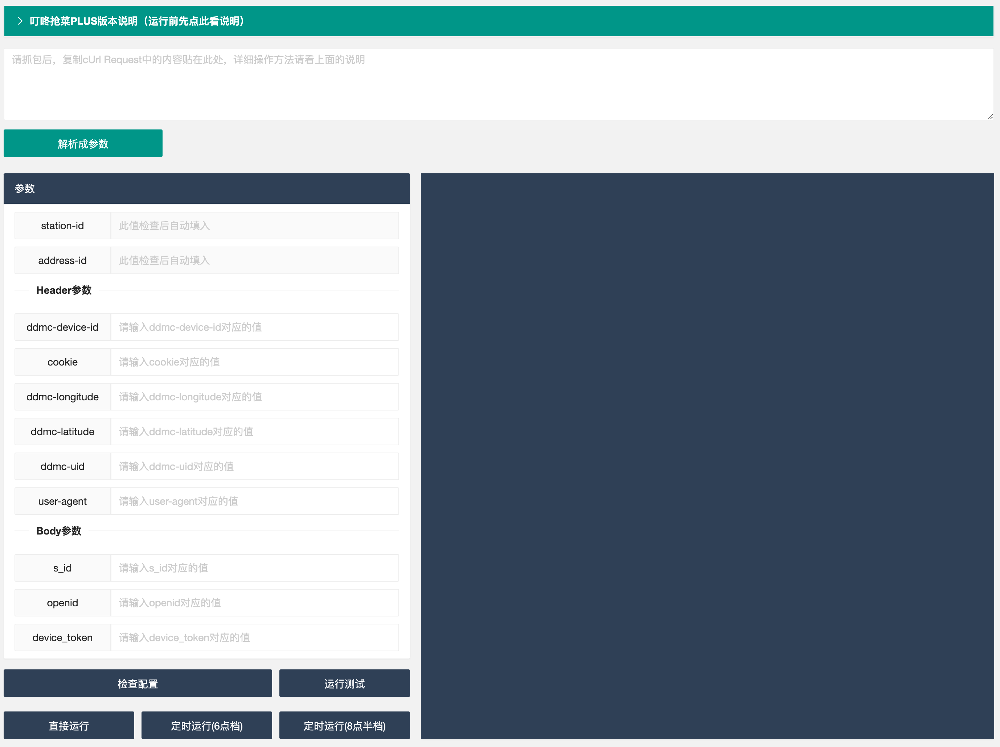
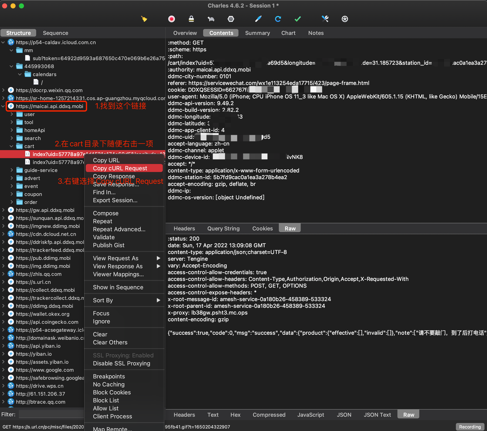
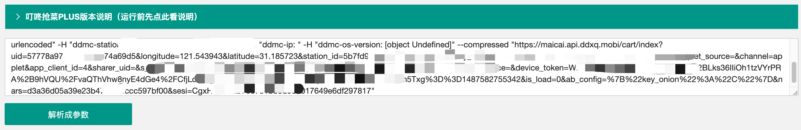

## 简短说明

此项目的核心后端程序来自于开源项目：https://github.com/JannsenYang/dingdong-helper

感谢这位作者的无私奉献，让身处疫情之中的我们能够顺利抢到菜吃饱饭。希望上海早日解封，恢复正常的生活！

此项目只是原项目基础上进行修改，提供了web版本，让未安装java环境的普通用户能顺利抢菜。

不过即使省去了java环境的安装，能直接运行，但是前期抓包获得参数这一步还是省略不了。

从这个意义上来说，普通人使用还是需要一定的门槛。如果你是技术人员可以忽略下面的抓包教程。

还有就是此项目仅限于在上海抢不到菜的人使用，其他地区请勿用。


## 如何使用

你可以到百度网盘中去下载你系统对应的软件包

地址为：

```
链接: https://pan.baidu.com/s/1h6Z39gJ5E6qKtubfk0RfyQ 提取码: i3en 
```

软件提供三种版本，macOS arm64版本，macOS X86版本，和windows版本。

本软件虽然用Java所写，但是运行时无需你装好Java环境，包内自带Jre。照顾了非技术的同学。可以直接运行。

下载完软件包后，解压，直接运行run。

然后在打开浏览器，输入：http://127.0.0.1:8686

界面如下图所示：



## 抓包教程

界面中左边的参数就是需要抓包获得的。抓包只需要抓一次，并且参数会自动保存下来。不需要每次做这个操作的。

1.首先点https://www.charlesproxy.com/download/去下载Charles抓包软件，选择适合自己系统的安装软件进行安装。

2.然后安装SSL证书，整个过程很简单，过程文章写的很详细，一步步照做就行了。

MacOS版Charles设置链接：https://blog.csdn.net/z2181745/article/details/123002569。

Windows版Charles设置链接：https://blog.csdn.net/ZY_qili/article/details/123875251。

文章中每一步都要照做，细心点，别漏了步骤哦！

3.打开Charles，左边就是你实时访问出去的http连接，不用管。在电脑端的微信上打开叮咚小程序，这里注意，一定得是电脑端微信的小程序哦！不是手机端微信的小程序。（当然如果你会使用Charles会设置代理，那当我没说，此说明针对于非技术用户）

4.确保你电脑端叮咚小程序已经是登陆状态了，把你要买的地址设为默认。确认首页左上角是你选的地址。然后点击购物车。然后照着下图去复制请求串，贴到下面的大框内按解析按钮。

请仔细看下图，跟着步骤做！



然后把复制的字符串贴到下面这个框内，点解析




## WEB界面使用教程

电脑端的小程序只是用来抓包的，抓好就可以关掉了。此程序只是用来自动下单的。程序自动抢菜成功后（当然前提是你购物车得有东西可下单），在你的订单里会多出一个待支付的订单。你只需要在手机端APP支付就可以了。

当参数都填入后（最前面2个不用填），点击检查配置。如果参数没有问题的话，右边会显示你的stationId和addressId，程序会自动在左边填入这2个值。然后可以再点一次检查配置。提示所有参数配置正确就ok了。

你只需要在手机叮咚APP中把你想要菜加入购物车，然后在web页面上点击定时运行（6点档）或者定时运行（8点档）就可以了。程序会倒计时，到那个时间点，会自动帮你提交订单。

提交订单成功后，你可以在手机叮咚APP中看到一单待支付的订单。这时就可以愉快的支付了等待收货了。

其他按钮说明下，运行测试，是指只提交一次，用于验证。正式抢的时候不要点。

直接运行是指马上开始抢，你自己控制好时间，比如说5点59分30秒的时候点直接运行，也是可以的。但还是建议用定时运行功能。

不管抢到还是没抢到，程序都会在在正式开始抢之后的2分钟自动结束（定时的时间不算哦）。

## 关于成功率

这个抢菜程序的原理就是模拟小程序去多线程的发请求提交订单。

我的很多朋友已经抢到了，成功率还是很高的。所以还是感谢下原作者，本人锦上添花下，让没有开发环境的朋友，也能用这款软件抢到。

最后祝大家都能抢到菜，愿疫情快快结束，peace！